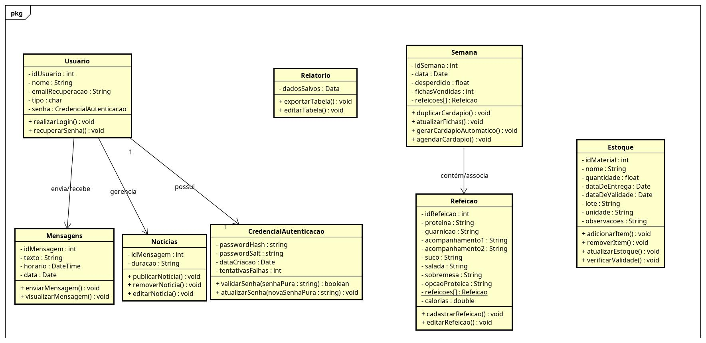

# Explicação do Diagrama de Classes

Este documento contém a explicação do diagrama de classes feito pelo aluno **Guilherme Andrade da Silva** através da ferramenta Astah UML.

## Classes do Diagrama

O diagrama é composto pelas seguintes classes:
* Usuário
* Mensagens
* Notícias
* Credencial Autenticação
* Relatório
* Semana
* Refeição
* Estoque

## Detalhamento das Funcionalidades

* **Usuário:** Contém o login, sua lógica para criação e recuperação de senha com segurança, além da opção de enviar mensagem e visualizá-las.
* **Relatório:** Responsável pelas funções de exportar os dados e salvá-los como tabelas, integrando-se com a lógica de *Semana* e *Refeição*.
* **Semana e Refeição:** A classe *Semana* contém *Refeição*, e *Refeição* contém um vetor estático de refeições. Essa estrutura existe porque as funções não são criadas novamente; elas já são pré-estabelecidas e a nutricionista apenas as escolhe, servindo também para a automatização da criação do cardápio.
* **Estoque:** Possui as funcionalidades clássicas de um estoque, prezando pela simplicidade e agilidade.

O foco principal foi colocado nas funcionalidades mais utilizadas, que, no caso do cliente, são voltadas para o **gerenciamento do cardápio**.